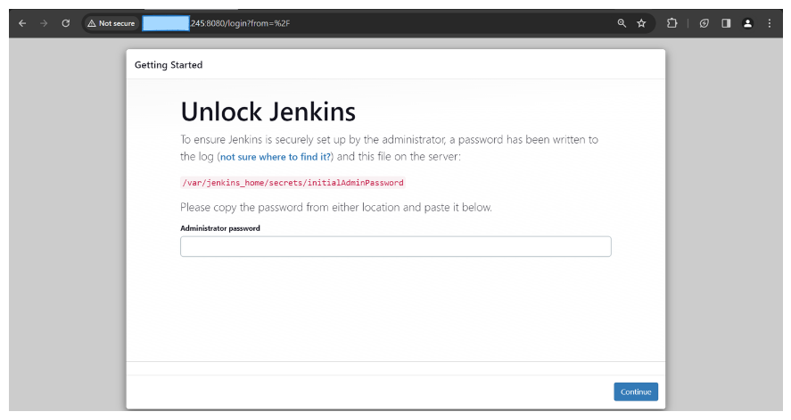
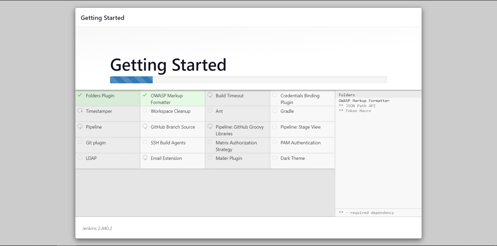
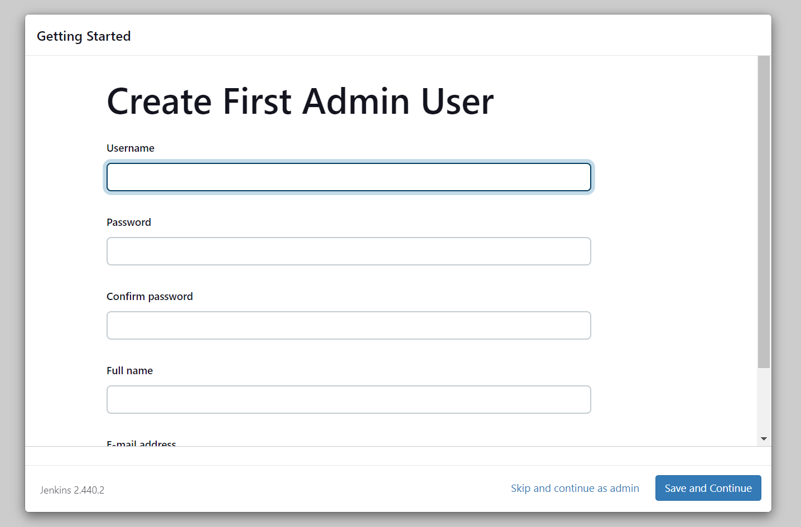
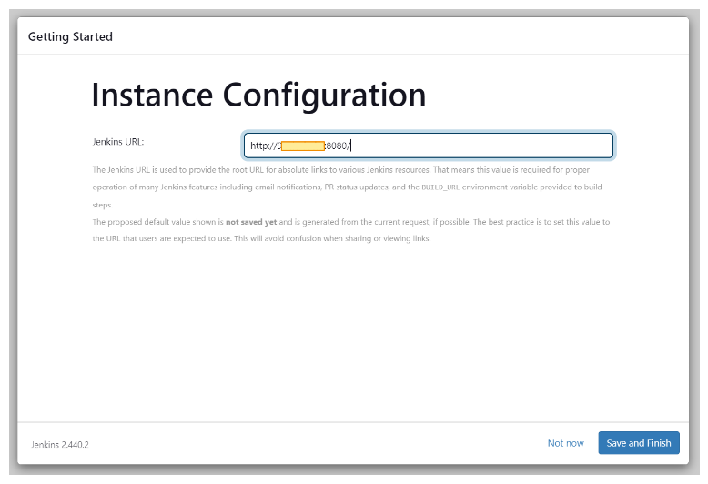
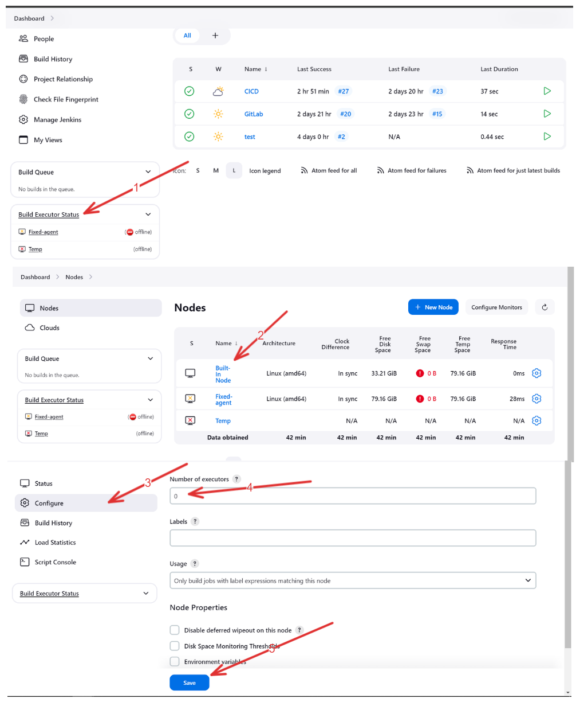
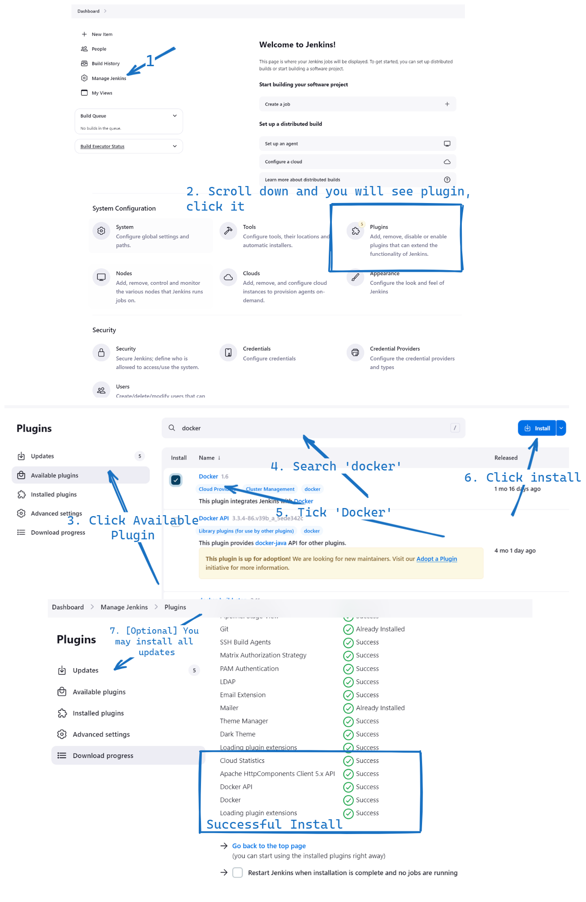
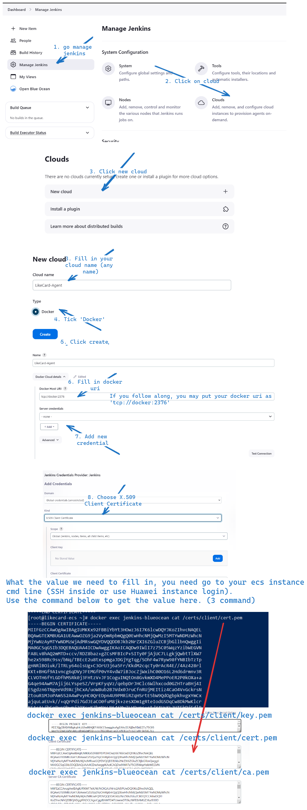
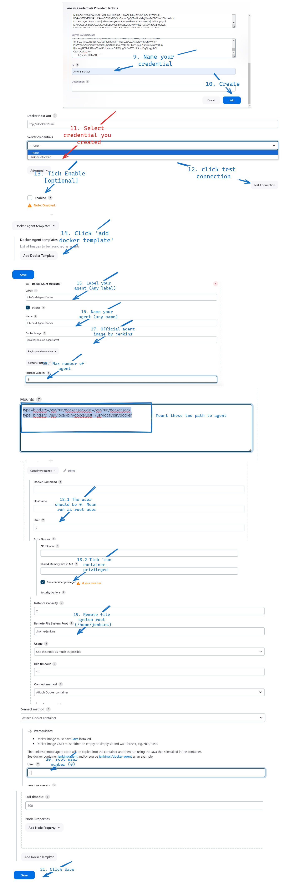
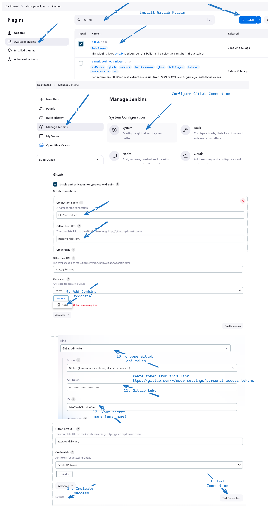
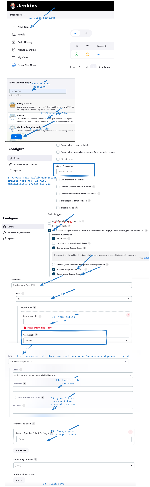

# Step By Step Jenkins CI/CD Guide with Huawei Cloud ECS.
1.	Programming language or framework to used is (.Net)
2.	CI/CD tool will be used (Jenkins)
3.	Source control management tool (GitLab)
4.	CI/CD environment (ECS)
5.	Application Environment (ECS)
6.	Special Request toward CICD pipeline
  -	Need to get manual approval before deploy to production environment
  -	Store the build artifact for each build. 

## 1. Infrastucture
Prepare related infrastucture using terraform
```bash
export HW_ACCESS_KEY="<- Your Huawei Access Key ->"
export HW_SECRET_KEY="<- Your Huawei Secret Key ->"
export PROJECT_ID="<- Your Project ID ->"
export PASSWORD="<- Your ECS password, will used for SSH ->"

terraform init
TF_VAR_secret_key=$HW_SECRET_KEY TF_VAR_access_key=$HW_ACCESS_KEY TF_VAR_password=$PASSWORD TF_VAR_project_ID=$PROJECT_ID terraform apply
```

## 2. Jenkins Deployment
```bash
#1. Install docker 
dnf install docker
systemctl start docker

#2. Deploy Jenkins To Docker
docker network create jenkins
docker run --name jenkins-docker --rm --detach \
  --privileged --network jenkins --network-alias docker \
  --env DOCKER_TLS_CERTDIR=/certs \
  --volume jenkins-docker-certs:/certs/client \
  --volume jenkins-data:/var/jenkins_home \
  --publish 2376:2376 \
  --publish 8000:8000 \
  --publish 5000:5000 \
  docker:dind

docker run --name jenkins-blueocean --restart=on-failure --detach \
  --network jenkins --env DOCKER_HOST=tcp://docker:2376 \
  --env DOCKER_CERT_PATH=/certs/client --env DOCKER_TLS_VERIFY=1 \
  --volume jenkins-data:/var/jenkins_home \
  --volume jenkins-docker-certs:/certs/client:ro \
  --privileged \
  --user=root --publish 8080:8080 --publish 50000:50000 swr.ap-southeast-3.myhuaweicloud.com/test-fq/likecard-jenkins:latest

# 3. Get "first time login" password
docker exec jenkins-blueocean cat /var/jenkins_home/secrets/initialAdminPassword

# 4. Copy the password to your jenkins browser.
# 5. Install default plugin
# 6. Create first admin user
```






## Jenkins Agent 
First, we will turn off of using node executor, which this action will not allow to run pipeline together with Jenkins application, instead we will run pipeline on isolate environment call agents which we will configure in next few step. This is the best practice recommended by Jenkins to improve security measure.

To turn off node executor follow below figure. 


Then we need to create agent to run pipeline. First, we need to install relative Jenkins plugin.Follow step from below figure.


Then, we need to configure our agent. 

```bash
# Get Docker client cert data for 
docker exec jenkins-blueocean cat /certs/client/key.pem
docker exec jenkins-blueocean cat /certs/client/cert.pem
docker exec jenkins-blueocean cat /certs/client/ca.pem
```


```bash
# Agent Mounts
type=bind,src=/var/run/docker.sock,dst=/var/run/docker.sock
type=bind,src=/usr/local/bin/docker,dst=/usr/local/bin/docker
```

## Pipeline Creation.
We have two requirement during pipeline design, first is store the dotnet artifact and request for approval before make deployment to production.

Before we create the pipeline, we first need to interconnect GitLab with this pipeline. Follow the figure below to perform this configuration.



Then you can start creating your first pipeline. Remember the pipeline also need to connect to your gitlab repository. Follow the figure below.



Then we need to configure the credentials used in Jenkinsfile. Follow the figure below.


```bash
# Before create docker in docker, you need to add 'docker' user group
# Ref: https://stackoverflow.com/questions/47854463/docker-got-permission-denied-while-trying-to-connect-to-the-docker-daemon-socke
# Ref: https://www.digitalocean.com/community/questions/how-to-fix-docker-got-permission-denied-while-trying-to-connect-to-the-docker-daemon-socket

docker network create jenkins
docker run --name jenkins-docker --rm --detach \
  --privileged --network jenkins --network-alias docker \
  --env DOCKER_TLS_CERTDIR=/certs \
  --volume jenkins-docker-certs:/certs/client \
  --volume jenkins-data:/var/jenkins_home \
  --publish 2376:2376 \
  --publish 8000:5000 \
  docker:dind

docker run --name jenkins-blueocean --restart=on-failure --detach \
  --network jenkins --env DOCKER_HOST=tcp://docker:2376 \
  --env DOCKER_CERT_PATH=/certs/client --env DOCKER_TLS_VERIFY=1 \
  --volume jenkins-data:/var/jenkins_home \
  --volume jenkins-docker-certs:/certs/client:ro \
  --privileged \
  --user=root --publish 8080:8080 --publish 50000:50000 swr.ap-southeast-3.myhuaweicloud.com/test-fq/likecard-jenkins:latest

docker exec d6c8b4e4692aec142b1375a1852ef507a6ff3bcca4eb666e17bf9a32e88a3a8c cat /var/jenkins_home/secrets/initialAdminPassword
```


## Sending Email 

```bash
# https://stackoverflow.com/questions/30185988/jenkins-email-sending-fails
Email sending failed, because of SMTP server not configure
```
```
docker build -t ap-southeast-3.myhuaweicloud.com/test-fq/likecard-jenkins:latest .

jenkins/agent:latest-alpine3.19-jdk21
```